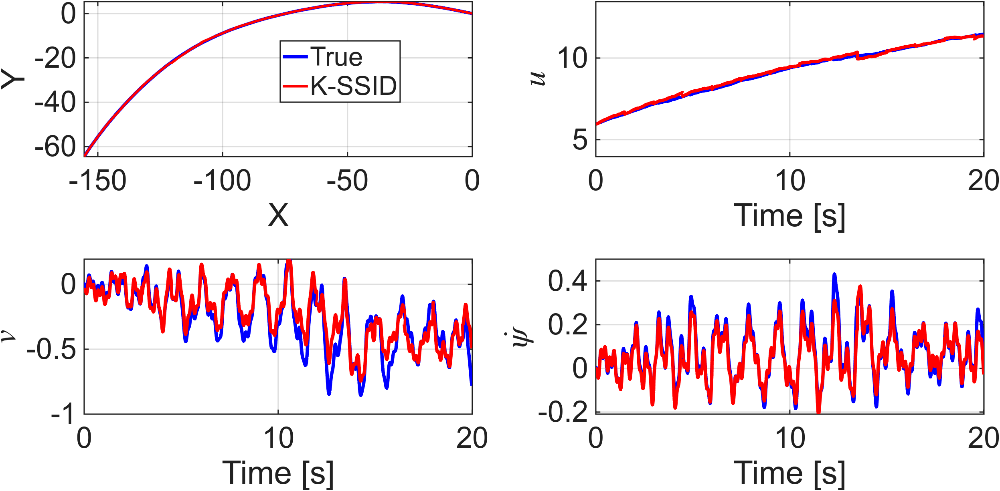
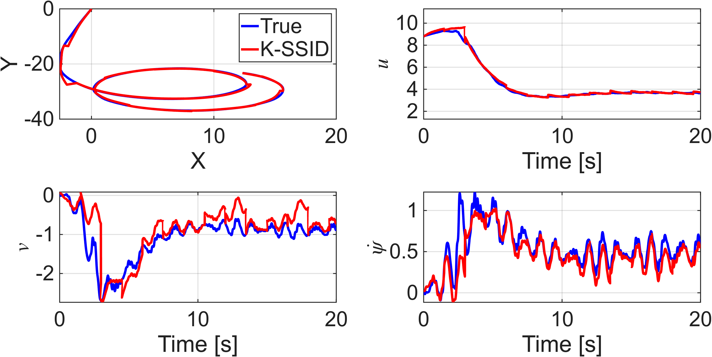
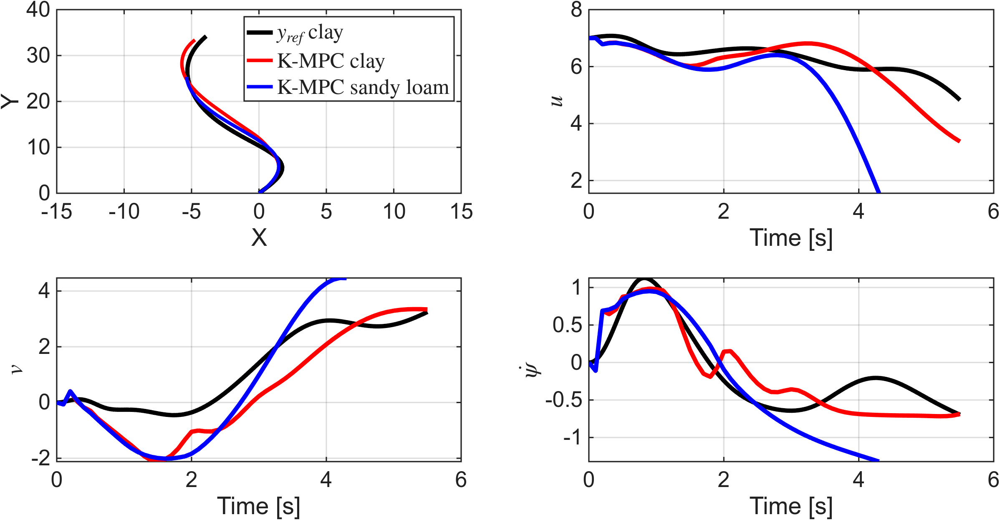
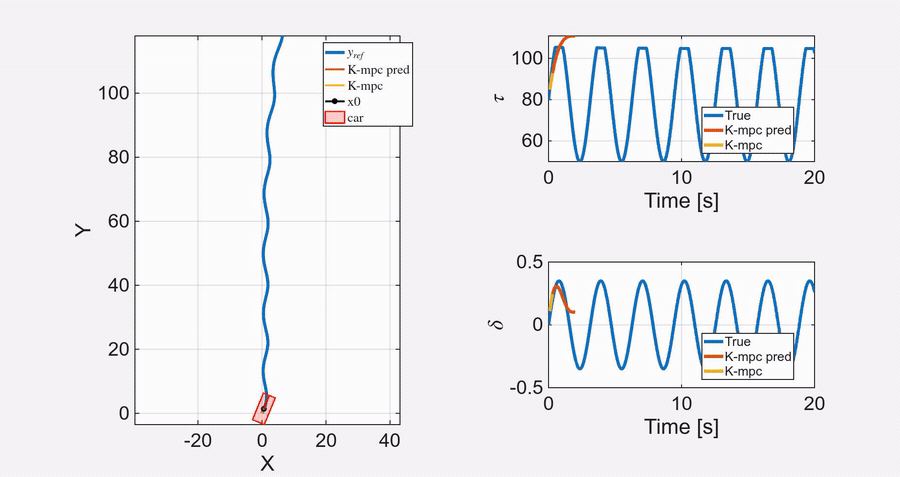
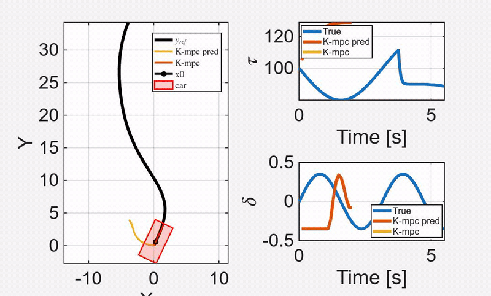

# Koopman Operator Framework for Off-Road Vehicle Modeling and Control

[](https://arxiv.org/abs/2603.28965)
[](https://www.mathworks.com/products/matlab.html)

MATLAB research code accompanying the paper **“Koopman Operator Framework for Modeling and Control of Off-Road Vehicle on Deformable Terrain”** by Kartik Loya and Phanindra Tallapragada.

The paper is available on [arXiv](https://arxiv.org/abs/2603.28965) and has been submitted to the *ASME Journal of Autonomous Vehicles and Systems* (JAVS-26-1012).

## Overview

This repository implements a hybrid physics-informed and data-driven framework for predicting and controlling off-road vehicle motion on deformable terrain. The workflow combines:

- a five-degree-of-freedom vehicle simulation with Bekker–Wong terramechanics;
- simulated trajectories on sandy loam and clay;
- recursive subspace identification with Grassmannian-distance-based data selection;
- a finite-dimensional linear Koopman predictor with Gaussian-process lifting; and
- constrained Koopman model predictive control (KMPC) for trajectory tracking.

The learned models provide stable short-horizon predictions, can account for mild terrain-height variation, and support closed-loop tracking subject to steering and wheel-torque constraints.

## Representative results

### Koopman prediction

The following examples compare the simulated vehicle response (blue) against the K-SSID prediction (red) over a 20-second horizon.

| Sandy loam | Clay |
|:---:|:---:|
|  |  |

### Koopman model predictive control

The constrained KMPC comparison below shows reference tracking and the predicted body-frame velocity states using the clay and sandy-loam Koopman models.

<p align="center">
  
</p>

### Closed-loop KMPC animations

These animations show the evolving reference path, closed-loop vehicle trajectory, Koopman prediction, and constrained steering and torque inputs for terrain-matched models.

| Sandy-loam model on sandy loam | Clay model on clay |
|:---:|:---:|
|  |  |

## Repository structure

```text
functions/
  simulation_model/       Vehicle and deformable-terrain dynamics
  utility/                Recursive SSID, Koopman fitting, and prediction
scripts/
  simulation/             Flat-terrain data generation
  simulation_elev/        Terrain-height-variation data generation
  data_handler/           Dataset assembly and train/validation/test splits
  koopman_training/       Model training and hyperparameter sweeps
result_analysis/
  Clay_prediction/        Clay prediction analysis and figures
  Sandyloam_prediction/   Sandy-loam prediction analysis and figures
  koopman_MPC/            Koopman MPC scripts and results
```

Large simulation datasets, trained model workspaces, and generated MATLAB result files are intentionally excluded from Git.

## Requirements

- MATLAB R2023b or a compatible release
- System Identification Toolbox
- Statistics and Machine Learning Toolbox
- Optimization Toolbox
- Parallel Computing Toolbox (for `parfor` training and simulation loops)
- [CasADi for MATLAB](https://web.casadi.org/get/) with IPOPT for the KMPC scripts

The MATLAB release shown above matches the supplied SLURM scripts. Other recent releases may work but have not been documented here.

## Workflow

Run MATLAB from the repository root and add the project functions to the path:

```matlab
addpath(genpath("functions"));
```

The main stages are:

1. Generate input signals with `scripts/offroad_Inputsignals.mlx`.
2. Generate terrain-specific trajectories with the scripts in `scripts/simulation/` or `scripts/simulation_elev/`.
3. Assemble the trajectories into training, validation, and test sets with `scripts/data_handler/gather_plot_data.m`.
4. Train Koopman models with `scripts/koopman_training/Offroad_Koopman_Training_main.m`. The example SLURM array scripts in `scripts/koopman_training/results/` pass the dataset path and the hyperparameters listed in `scripts/koopman_training/params.txt`.
5. Reproduce prediction plots with the scripts under `result_analysis/Clay_prediction/` and `result_analysis/Sandyloam_prediction/`.
6. Run constrained trajectory-tracking examples from `result_analysis/koopman_MPC/` after changing the CasADi and model paths for your machine.

Several scripts contain experiment-specific relative paths and are intended as research artifacts rather than a packaged MATLAB application. Update dataset, output, and CasADi paths before running them.

## Data and generated models

The full datasets and trained MATLAB workspaces are too large for standard Git hosting. The code expects terrain datasets under `datasets/` and model files under:

```text
scripts/koopman_training/results/clay_noelev_models/models_with_error/
scripts/koopman_training/results/sandyloam_noelev_models/models_with_error/
```

Contact the authors if you need access to the exact data or trained models used in the paper.

## Citation

If this repository is useful in your research, please cite:

```bibtex
@article{loya2026koopman,
  title   = {Koopman Operator Framework for Modeling and Control of Off-Road Vehicle on Deformable Terrain},
  author  = {Loya, Kartik and Tallapragada, Phanindra},
  journal = {arXiv preprint arXiv:2603.28965},
  year    = {2026},
  doi     = {10.48550/arXiv.2603.28965}
}
```

## Paper

K. Loya and P. Tallapragada, “Koopman Operator Framework for Modeling and Control of Off-Road Vehicle on Deformable Terrain,” arXiv:2603.28965, 2026. [Paper](https://arxiv.org/abs/2603.28965) · [PDF](https://arxiv.org/pdf/2603.28965)
